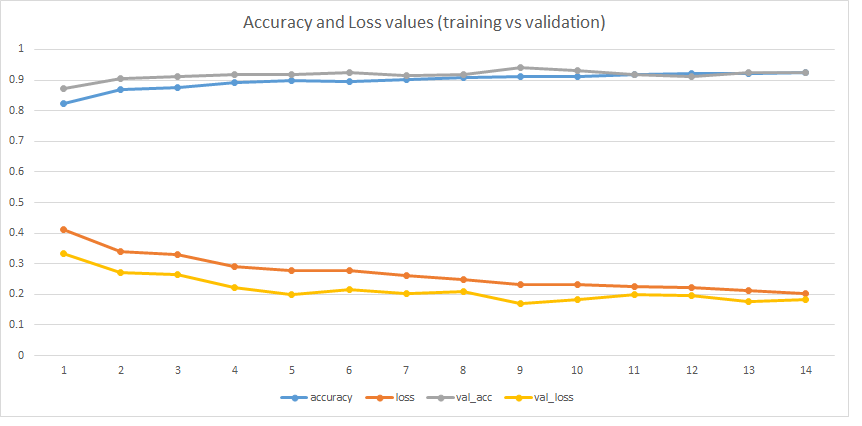

# face_with_mask_classification
This is a Toy project to play with my gained knowledge through Deeplearning.ai course within Coursera.

Because of Covid-19 Pandemic, I started a face mask classification project to classify people with/without face masks.

Dataset is downloaded from the following repository, which includes people faces with/without masks (1,900 images in each category): 
https://github.com/balajisrinivas/Face-Mask-Detection

sample images: 

After data cleaning and spliting data to train/test set (90%/10%) I started designing different conv nets. 

First convnet was a 5 layer model with 16, 32 number of filters and 60% accuracy (conv2D -> BatchNorm -> Relu -> Maxpool) x 5 + Fully_Conncted.  

After Hyperparameter tuning I used a 3 layer convnet with 32, 32, 64 number of filters and reached above 92% accuracy.

Final results of the convnet model are shown in the following.

Now I want to use Transfer Learning to see whether a more complex model can predit better or not.
